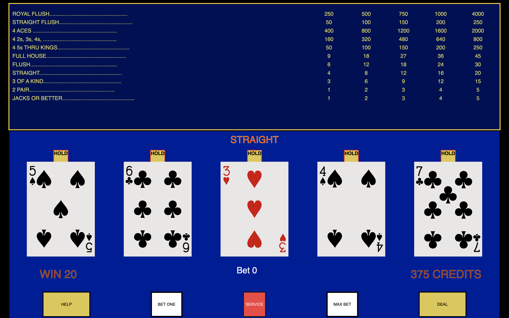

<div id="header" align="center">

  

</div>

<div id="description" align="center">

# Video Poker

### [CLICK TO DEMO](https://richardmundyiii.github.io/videoPoker/)

##### Richard Mundy

[](https://www.linkedin.com/in/richardmundyiii/)

## :pencil: Description

:spades: :diamonds: :clubs: :hearts:

Just as you would find in the smoke-filled casinos of Atlantic City or Las Vegas, this fun and exciting game of video poker is at your fingertips. Play from 1 to 5 credits and take your chance at hitting it big with a Royal Flush (pays 4,000 credits with max bet). :money_mouth_face:

</div>

<div>

## :camera_flash: Screenshots




</div>

<div align="center">

## :computer: Technologies Used


</div>

<div>

## :fire: Getting Started

### [CLICK TO DEMO](https://richardmundyiii.github.io/videoPoker/)

1. When the page loads:

   - All 5 cards will be facing down.
   - The 'DEAL' button will be disabled.
   - 'Bet One' and 'Max Bet' buttons will be available to push.
   - All 'HOLD' visuals will be hidden
   - Winning Hands and Payouts will be visible at top of page
   - Players available credit will be shown.

2. Player will need to choose either 'Bet One' (up to 5 times) or 'Max Bet' before the game starts.
3. Once a credit has been chosen the 'DEAL' button will be avaiable to press.
   - If 'Max Bet' (once) or 'Bet One' (5 times) has been pressed, both bet buttons will be disbaled.

</div>

<div>

## The Game

1. Player will have 400 credits.
2. Once the player has selected their bet and has pressed the 'DEAL' button, the game will begin.
   - The player's credits will be reduce by the amount wagered
   - The deck shuffles
3. 5 cards will then be delt and displayed on the screen
   _ If a winning hand has come on the 'flop' the winning hand will be highlighted at the top of the board in the 'Winning Hands / Payouts' section.
   _ Beware! IF, the players does not hold all cards that equalled the win and continues with the game, they forfieit those cards and potential winnings.
4. They player then chooses to keep up to all 5 cards, or none at all, by clicking on each card they wish to keep. \* A 'HOLD' sign will illuminate above the card selected to indicate to the player the card has been held.
5. The game will then replace all non-held cards with the next, up to, 5 cards in the deck.
   - If a player has a winning hand the winning hand name and payout will illumiinate at the top of the screen.
   - The amount won will be displayed at the bottom left of the screen, just above help.
   - The players total credits will increase by the amount won.
   </div>

<div>

## Winning Hand Odds & Payouts

<table>
<tr><th>Odds</th><th>Payouts</th><tr>
<tr><td>

| Hand              | Odds    |
| ----------------- | ------- |
| Royal Flush       | 80 : 1  |
| Straight Flush    | 50 : 1  |
| 4 As              | 400 : 1 |
| 4 2s,3s,4s        | 160 : 1 |
| 4 5s thru Ks w/ A | 80 : 1  |
| 4 5s thru Ks      | 50 : 1  |
| Full House        | 9 : 1   |
| Flush             | 6 : 1   |
| Straight          | 4 : 1   |
| 3 of a Kind       | 3 : 1   |
| 2 pairs           | 1 : 1   |
| Jacks or Better   | 1 : 1   |

</td><td>

| Hand            | 1   | 2   | 3    | 4    | 5    |
| --------------- | --- | --- | ---- | ---- | ---- |
| Royal Flush     | 250 | 500 | 750  | 1000 | 4000 |
| Straight Flush  | 50  | 100 | 150  | 200  | 250  |
| 4 As w/ 2,3,4   | 400 | 800 | 1200 | 1600 | 2000 |
| 4 2s,3s,4s      | 160 | 320 | 480  | 640  | 800  |
| 4 5s thru Ks    | 40  | 80  | 120  | 160  | 200  |
| Full House      | 8   | 16  | 24   | 32   | 40   |
| Flush           | 5   | 10  | 15   | 20   | 25   |
| Straight        | 4   | 8   | 12   | 16   | 20   |
| 3 of a Kind     | 3   | 6   | 9    | 12   | 15   |
| 2 pairs         | 1   | 2   | 3    | 4    | 5    |
| Jacks or Better | 1   | 2   | 3    | 4    | 5    |

</td></tr>
</table>
</div>

<div>

## :spades: About the Shuffle :spades:

There are a lot of different ways to shuffle, or not shuffle, a deck of cards to generate a random order. The simplest way to "shuffle" a deck would be to not shuffle at all. Meaning just randomly pick a card from the deck and place it in its new array. Pros for this would be very minimal coding and easy to read, even for beginner javascript learners, and in fact does randomly select a card from the deck.

```javascript
for (let i = 0; i < originalDeck.length; i++) {
  originalDeck.push(deck.splice(Math.floor(Math.random() * deck.length), 1)[0]);
}
```

The Fisher–Yates shuffle is an algorithm for generating a random permutation of a finite sequence. The algorithm effectively puts all the elements into a hat; it continually determines the next element by randomly drawing an element from the hat until no elements remain. The algorithm produces an unbiased permutation: every permutation is equally likely. The modern version of the algorithm is efficient: it takes time proportional to the number of items being shuffled and shuffles them in place.

I start off by copying the original deck and adding it to my shuffle function. We will then iterate over the deck array and create two variables which will hold two temporary card values. As the function iterates over the array it will swap the values of the first and second random indexes. This will create a "shuffled" deck however there is no gurantee that the same index number was not called mutliple times in a row which would esentially equate to a portion of the deck not getting shuffled. So I wrapped that into another for loop to run 1000 times, in turn, reducing the odds of a portion of the deck from not being shuffled.

```javascript
function deckShuffle() {
  tempDeck = [...ORIGINAL_DECK];
  for (let k = 0; k < 1000; k++) {
    for (let i = tempDeck.length; i--; ) {
      let j = Math.floor(Math.random() * (i + 1));
      let temp = tempDeck[i];
      tempDeck[i] = tempDeck[j];
      tempDeck[j] = temp;
    }
  }
  return tempDeck;
}
```

</div>

<div>

## :bowtie: Next Steps

- :white_check_mark: Help Button to give in-game assistance
- Speed button to control how quickly/slowly the cards are delt
- Sound for the shuffle and dealing of cards
- Additional types of video poker games
- Add service button w/ modal admin popup.
- - The idea here is to see previous hands to analyize if they player is going for higher risk hands or staying with, easy, winnable hands.

</div>

### References

Wikipedia: [Fisher-Yates Shuffle](https://en.wikipedia.org/wiki/Fisher%E2%80%93Yates_shuffle)
